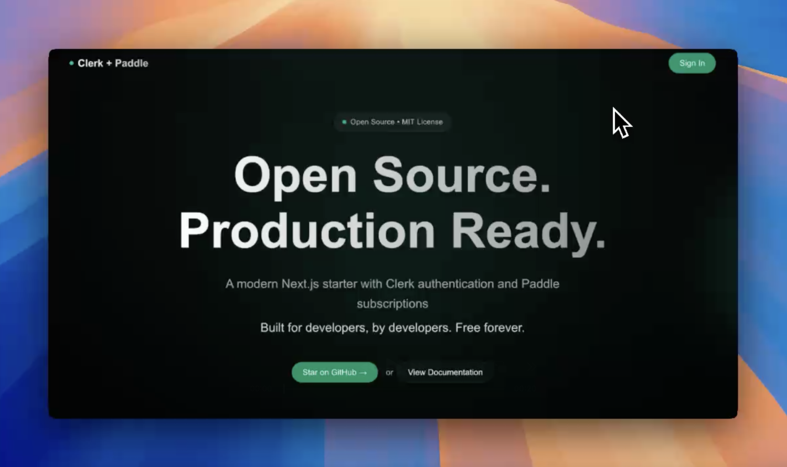
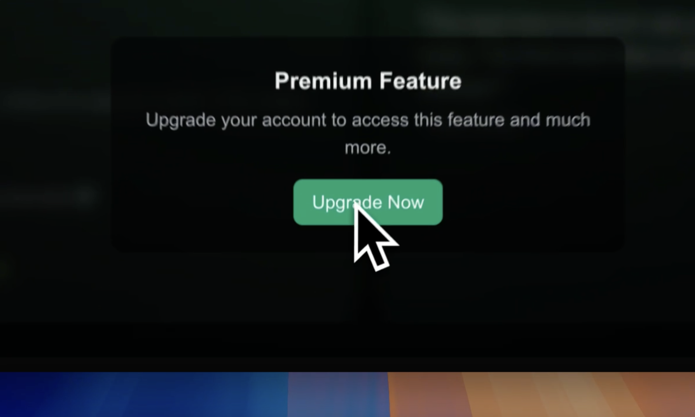

# ⚡️ Next.js + Clerk + Paddle Starter

Build your next SaaS in a weekend! This starter template gives you everything you need to start selling your SaaS subscription today:

- 🔐 Authentication? **Done!** (thanks [Clerk](https://clerk.com))
- 💳 Billing? **Done!** (thanks [Paddle](https://paddle.com))
- 🎨 Beautiful UI? **Done!** (thanks [Tailwind](https://tailwindcss.com))
- 🚀 Performance? **Done!** (thanks [Next.js 15.4](https://nextjs.org))

## ✨ Features

- **Modern Stack**: Next.js 15.4 with Turbopack, React 19.1
- **Authentication**: Email, social, session management
- **Billing**: Checkout, customer portal, trials
- **Beautiful UI**: Dark mode, animations, gradients
- **Type-Safe**: 100% TypeScript
- **Production-Ready**: Deploy anywhere

## 🚀 Quick Start

1. Clone & Install
```bash
git clone https://github.com/yourusername/clerk-paddle-quickstart
cd clerk-paddle-quickstart
npm install
```

2. Set up your environment
```bash
cp .env.example .env.local
```

3. Add your keys to `.env.local`:
```bash
# Clerk Auth
NEXT_PUBLIC_CLERK_PUBLISHABLE_KEY=pk_test_******
CLERK_SECRET_KEY=sk_test_******

# Paddle Billing
NEXT_PUBLIC_PADDLE_CLIENT_TOKEN=ptk_dev_******
PADDLE_SECRET_KEY=psk_dev_******
NEXT_PUBLIC_PADDLE_PRICE_ID=pri_******
```

4. Start coding!
```bash
npm run dev
```

## 📚 Documentation

- [Architecture Overview](docs/architecture.md)
- [Clerk Integration](docs/clerk.md)
- [Paddle Integration](docs/paddle.md)

## 🎥 Demo

#### Auth Demo
[](https://github.com/hr23232323/clerk-paddle-quickstart/blob/main/public/Auth%20Demo.mp4?raw=true)

[](https://github.com/hr23232323/clerk-paddle-quickstart/blob/main/public/Demo%20-%20Billing.mp4?raw=true)


## 🛠 Coming Soon

- 🔄 Paddle webhook handling
- ✅ Webhook signature verification
- 📊 Usage tracking
- 📱 Mobile responsive enhancements

## 📖 Learn More

- [Clerk Documentation](https://clerk.com/docs)
- [Paddle Documentation](https://paddle.com/docs)
- [Next.js Documentation](https://nextjs.org/docs)

## 📝 License

MIT
