# Architecture

This template uses Clerk's metadata to manage subscription state, ensuring consistency between authentication and billing systems.

## System Overview

The following diagram shows how the different components interact:

```mermaid
sequenceDiagram
    autonumber
    participant U as User
    participant F as Frontend
    participant B as Backend
    participant C as Clerk
    participant P as Paddle

    rect rgb(40, 40, 40)
        Note over U,C: Authentication Flow
        U->>F: Sign in with Clerk
        F->>C: Authenticate
        C-->>F: Auth token
        F->>B: Initialize user metadata
        B->>C: Set subscription status
    end

    rect rgb(40, 40, 40)
        Note over U,C: Subscription Flow
        U->>F: Start subscription
        F->>P: Open Paddle Checkout
        P-->>F: Checkout completed
        F->>B: Update subscription
        B->>C: Update user metadata
    end

    rect rgb(40, 40, 40)
        Note over P,C: Coming Soon
        P->>B: Webhook events
        B->>C: Update user state
    end
```

This diagram illustrates the three main flows in the application:

## Key Components

### Frontend
- Next.js 15.4 App Router for routing and server components
- React components for UI
- Clerk components for auth UI
- Paddle.js for checkout experience

### Backend
- Next.js API routes for backend logic
- Clerk SDK for user management
- Paddle API for subscription management

### State Management
- Clerk metadata stores subscription state
- Public metadata for subscription status
- Private metadata for customer IDs and events

### Security
- All sensitive operations happen server-side
- Environment variables for credentials
- Protected API routes
- Secure metadata management 